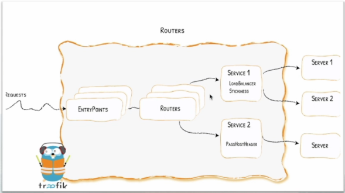
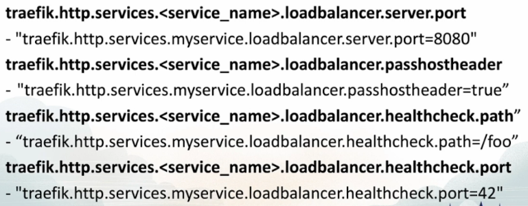
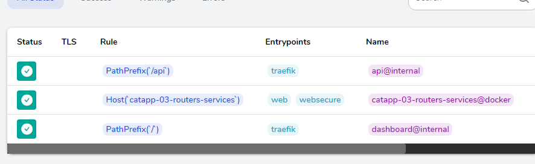

# Routers & Services


## Load Balancing & Routing

- How the incoming requests flow through Traefik is determined by the below components
  
  - **Providers** discover the services that live on your infrastructure (their IP, health, ..)
  
  - **Entrypoints** listen for incoming traffic (ports, ...)
  
  - **Routers** analyse the requests (host, path, headers, SSL, ...)
  
  - **Services** forward the request to your services (load balancing, ...)
  
  - **Middlewares** may update the request or make decisions based on the request (authentication, rate limiting, headers, ...)

## Routers - Connecting Requests to Services

#### Understanding Traefik Labels

- Let's take a look at how the Traefik labels are constructed


### Router Rules


- Note that when a new rule is created, Traefik automatically creates a corresponding service and router if not provided.

- The service automatically gets a server per instance of the container and the router automatically gets a rule defined by defaultRule (if no rule for it was defined in labels)

### Router Entrypoints


- All routers **WILL** accept all requests from all defined **Entrypoints**. Using a label can determine specific routers if required.

### Available Router Configs


## Load Balancers

- Each service has its own Load Balancers

- Load Balancers can load balance requests between multiple instances of your application

- The target of the Load Balancer is called a Server

- Only Round Robin Load Balacing is available using the same server

- Load Balancers can be configured with Health Checks to monitor the health of the Server. We can tell Traefik the endpoint to check for (for example, `/ping`, `/health` etc.)

- A Service can be assigned to one or more routers



### Available Service Configurations



- The `loadbalancer.server.port` is the port where we tell traefik to send all the ingress traffic for this service.

- The `loadbalancer.passhostheader` will pass down the host headers to the service.

- The `loadbalancer.healthcheck.path` will define the API endpoint for checking the health within the service.

- The `loadbalancer.healthcheck.port` tells the port to talk to for health check.

### Docker Specific Options

- `traefik.enable` - Tells traefik to override the `exposedByDefault` setting

- `traefik.docker.network` - overrides the default network used by Traefik

- `traefik.docker.lbswarm` - Enables Swarm's Built-in Load Balancer and stops using Traefik (You really don't need this.)

### TCP/UDP

- It is possible to create TCP/UDP Routers and Services also using Labels.
  
  - Enabled with labels
  
  - Follows the same principals at HTTP
  
  - Contains much less config options
  
  - Still requires an Entrypoint
  
  - Services are configured just for the connection between

## Traefik Key Things

### 1. Automatic Assigned Routes

- When you don't give any labels apart of `traefik.enable`, then traefik gives a `Host` path, `Service` name and `Route` with `LoadBalancer` all of them for it and all these are done automatically with random names.

```yaml
version: '3'
# Make services with reverse proxy using Traefik
services:
  traefik:
    image: traefik:v2.9
    ports:
      - 80:80
      - 443:443
      - 8080:8080
    volumes:
      - /var/run/docker.sock:/var/run/docker.sock
      - ./traefik.toml:/etc/traefik/traefik.toml

  catapp:
    image: mikesir87/cats:latest
    labels:
      - "traefik.enable=true"
```

- The following will trigger Traefik to automatically make routes and everything needed to expose the service on its own for the `catapp`.  We can check this in the dashboard.



- We can see that the `Host(catapp-03-routers-services)` is automatically made. You can use this path to access the service. 


- Now, note that this will also make services on its own. Be very careful - as this might cause issues.

# 
