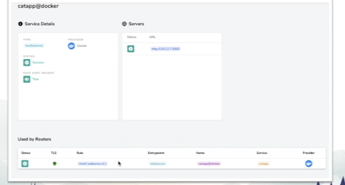
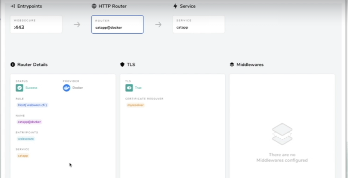
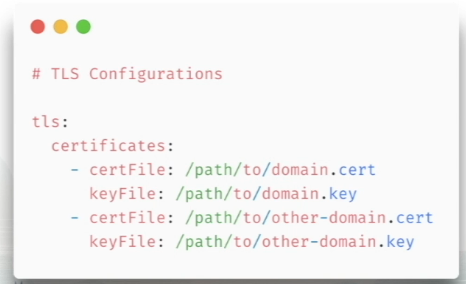
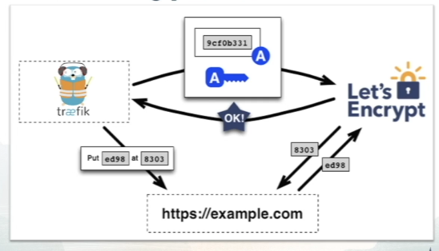

# HTTPS & TLS

## Types of HTTPS Certificates from Traefik

- **Default Certificate** - if not certified, then Traefik can generate and provide a self-signed cerificate.

- **User Defined** - Provide Certificates directly to Traefik which will then be applied to the matching Entrypoints

- **Automated** - Traefik uses Let's Encrypt to generate the certificates automatically on a per request basis.

### TLS & Traefik

- A green shield is shown in the service and the port served out is 443.

- In the routes, we can see the TLS is here as well.

## TLS User Defined

Can be added to Dynamic Configuration of Traefik using the File Provider or in Static Configuration.

- Bring your own certificates - Install and manage your own certificates

- Entrypoint Matching - Traefik automatically matches the Entrypoint request with the certificate

- TLS Configurations - You have TLS configuration options to manage the TLS connections (TLS versions, timeouts etc.)

## Let's Encrypt Challenge Types

Let's Encrypt validates you control the domain name by using "Challenges"

- **HTTP Challenge** - Let's Encrypt gives a token to Traefik which is then served back to Let's Encrypt for verification.

- **DNS Challenge** - Traefik uses your DNS providers API to place DNS TXT Records in your Domain records to verify ownership.

- **TLS Challenge** - Performs a handshake between Traefik and Let's Encrypt on port 443.

## HTTPS Challenge
