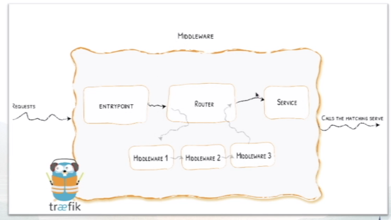
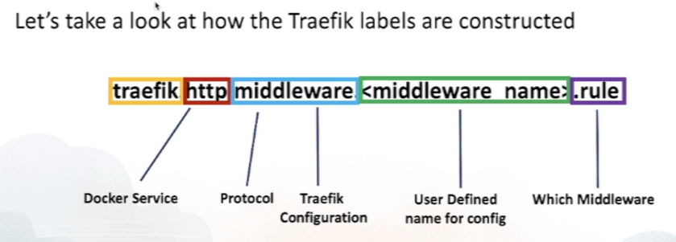
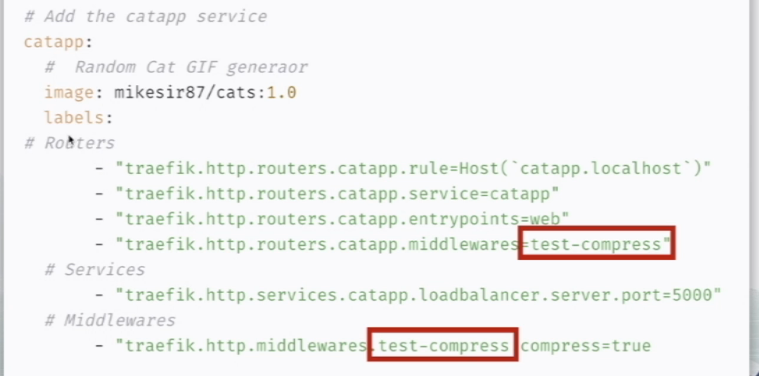
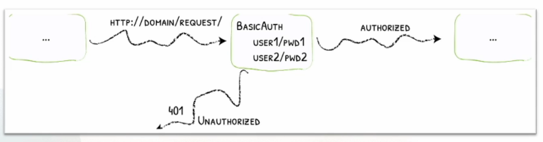
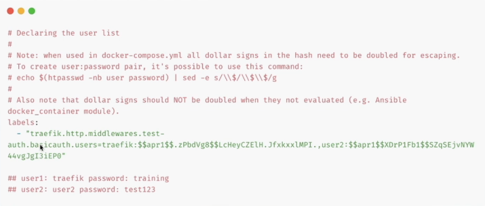
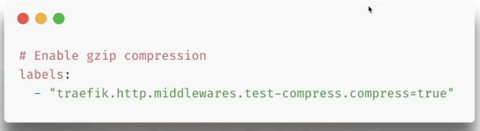
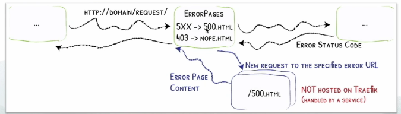
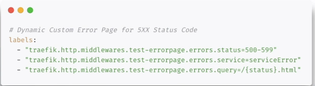
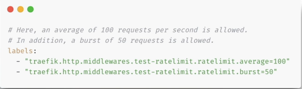
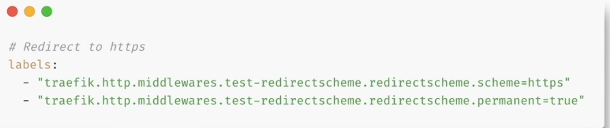

# Middlewares

- **Middlewares connect to Routers** - One or more Middlewares can connect to one or more routers

- **Intercepts Requests** - The Middleware transforms requests before they are sent to a service.

## Types of Middlewares

- **Authentication**- Handles user/service authentication

- **Content Modifier** - Manages the served content

- **Middleware Tool** - Middleware Management

- **Path Modifier** - Configures the handling of the URL structure

- **Request Lifecycle** - Applies rules to service requests

- **Security**- Secures access to the service

## Some Middlewares

- BasicAuth - Add Basic Authentication to services

- Compress - Enables gzip compression on severed content

- ErrorPage - Display custom error pages for 400/500 Errors

- RateLimit - Configure the number of allowed requests to the service

- RedirectScheme - Rewrite HTTP Requests to HTTPS

## Middleware Deployment

1. Create Middleware - Define the middleware with a nice name

2. Router <-> Middleware - Connect  the router to the middleware with that nice name

---

## BasicAuth Middleware

- Restricts access to the service using basic user/password

### Declare and set up a hashed password

- We can generate a hashed value of password with the help of `htpasswd -nb user password | sed -e s/\\$/\\$\\$/g`

----

## Compress Middleware

- Compressing the Response before Sending it to the client using gzip compression

- This is a common practice to include compression to all web services as it helps in faster response and loading time.

---

## Error Page Middleware

- Serve custom Error pages for 4xx/5xx errors

## Rate Limiting Middleware

- Limits the rate of access to a docker service

- **Average** - Maximum rate, in requests/second for a given source

- **Period** - The time period
  
  - Rate = average / period

- **Sources** - Headers, IP's or Hosts

### RedirectScheme (HTTP -> HTTPS) Middleware

- This allows us to redirect traffic from HTTP to HTTPS

