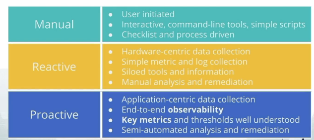
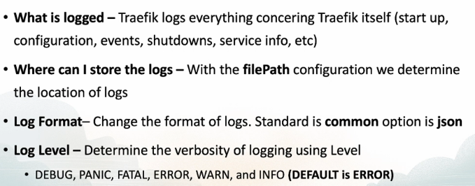

# Observability

These are set of tools that allow us to debug the site by enabling tracing

## Observability Overview

- **Traefik Logs** - Configure log level and storage path

- **Access Logs** - Who is accessing the services connected to Traefik and which service

- **Metrics/Monitoring** - Enable metrics for monitoring and demo

- **Tracing** - Enable Tracing to visualize comms flow

## Valid Monitoring o/p

- **Alerts** - Tell a human to take action on something happening or about to happen

- **Tickets** - Tell a human that action is required but not right away

- **Logging** - Stored for Diagnostics (or) Forensics

## Operational Models

## Users care about 3 things

- **Availability** - is <u>MY</u> system online yes/no

- **Latency** - Does it take a long time to access application x, y, z

- **Reliability** - Can the user rely on the application

---

## Traefik Logs

## Traefik Metrics

- Traefik supports 4x Metrics Backend

